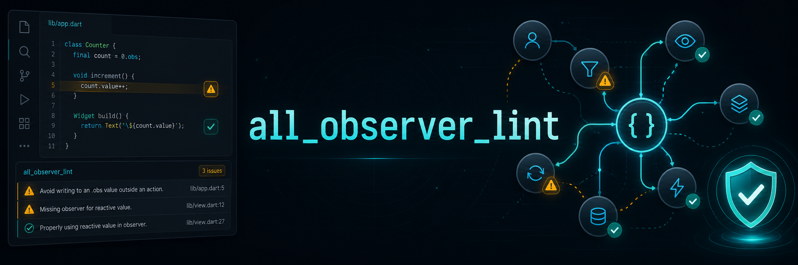

# all_observer_lint



Official lint rules for building safer Flutter and Dart apps with
[`all_observer`](https://github.com/CriandoGames/all_observer).

[Leia em português](README.pt-BR.md)

`all_observer_lint` helps catch common reactive mistakes directly in your IDE:
state created inside `build`, effects registered on every rebuild, invalid
`watch(context)` usage, impure `Computed` callbacks, and reactive resources that
were not disposed.

It is a development-only package. It does not change your app runtime.

## Install

Add both packages as development dependencies:

```bash
dart pub add --dev custom_lint all_observer_lint
```

For Flutter projects:

```bash
flutter pub add --dev custom_lint all_observer_lint
```

Your `pubspec.yaml` should contain:

```yaml
dev_dependencies:
  custom_lint: ^0.8.0
  all_observer_lint: ^0.6.0
```

`custom_lint` is required because it is the analyzer runner that loads custom
lint plugins. `all_observer_lint` provides the rules.

## Configure

In `analysis_options.yaml`, use the recommended preset:

```yaml
include: package:all_observer_lint/recommended.yaml
```

That preset enables the `custom_lint` analyzer plugin and the recommended rule
set.

To show diagnostics in Brazilian Portuguese:

```yaml
include: package:all_observer_lint/recommended.yaml

custom_lint:
  rules:
    - all_observer:
      language: pt-BR
```

### Migrating from 0.3.x

The package installation command did not change, but custom options now use
the `custom_lint.rules` configuration shape. If you previously configured
Portuguese diagnostics with a top-level `all_observer:` key, move that option
under `custom_lint.rules` as shown above.

## Run

Use your normal analyzer workflow:

```bash
dart analyze
```

Or run the custom lint runner directly:

```bash
dart run custom_lint
```

In Flutter projects:

```bash
flutter analyze
dart run custom_lint
```

Most IDEs show the diagnostics automatically after `pub get`.

## Example

This code creates reactive state every time the widget rebuilds:

```dart
Widget build(BuildContext context) {
  final count = 0.obs;
  return Text('${count.value}');
}
```

`all_observer_lint` reports:

```text
warning: Avoid creating reactive state inside build. The resource will be
recreated whenever the widget rebuilds. Move it to a State field, initState,
controller, view model, or another lifecycle-managed object.
```

Move the state to a lifecycle-managed place:

```dart
class _CounterPageState extends State<CounterPage> {
  final count = 0.obs;

  @override
  Widget build(BuildContext context) {
    return Observer(() => Text('${count.value}'));
  }
}
```

## Quick Fixes

Some rules provide IDE quick fixes. `dispose_reactive_resources` selects the
call from the field's resolved type. In particular, an `effect()` disposer is
invoked as a callback:

```dart
class _SearchPageState extends State<SearchPage> {
  late final disposeEffect = effect(() => query.value);

  @override
  void dispose() {
    disposeEffect();
    super.dispose();
  }
}
```

## Assists

Select a resolved Widget expression containing an immediate reactive read and
choose **Wrap with Observer**. It generates the public
`Observer(() => widget)` constructor, reuses prefixed imports, and adds an
import when safe — falling back to a freshly generated, uniquely-named
prefixed import (e.g. `allObserver.Observer`) whenever a bare `Observer`
reference would be shadowed or ambiguous (a same-named declaration in the
file, a locally-shadowing parameter/variable, or another unprefixed import
that also exposes `Observer`). It stays unavailable in callbacks, tracked
contexts, `watch(context)`, constant contexts, and unresolved code.

Selecting a reactive `.value` read (of an `Observable`/`Computed`) instead
also offers **Wrap smallest reactive subtree with Observer** — a more
targeted action that wraps only the smallest Widget containing that read,
leaving surrounding siblings untouched, and that stays unavailable when the
read only reaches a Widget through an event-handler closure (e.g.
`onPressed`) or when the Widget is already exactly the root of an enclosing
`Observer` builder.

Selecting an expression that reads two or more distinct reactive values
(e.g. `price.value * quantity.value`) offers **Extract reactive expression
to Computed**: it adds a `late final <name> = Computed(() => <expression>)`
field and replaces the selection with `<name>.value`. This first version is
deliberately narrow — no method calls, no locals/parameters, no
`BuildContext`/`widget.` access anywhere in the expression, and the
enclosing class must be a `State` with its own `dispose()`/
`super.dispose()` (where `<name>.close()` is inserted) — and always uses a
generic fallback name (`computedValue`, `computedValue2`, ...) rather than
guessing one from the expression. See `documentation/architecture.md` for
the full list of gates.

Selecting a private `ValueNotifier<T>` field/top-level declaration offers
**Convert ValueNotifier to Observable**: it rewrites the type/constructor to
`Observable`, rewrites any `.dispose()` call to `.close()`, and leaves
`.value` reads/writes and any `addListener`/`removeListener` call
completely untouched — `Observable.addListener`/`removeListener` are
verified, real-source-confirmed drop-in equivalents that never invoke the
callback immediately, so no listener rewrite is needed. Stays unavailable
for a public field, an indirectly-constructed `ValueNotifier`, a field
passed anywhere as an argument (covers `ValueListenableBuilder`-style
consumers), or unbalanced `addListener`/`removeListener` usage.

Selecting a private field with a matching, pure passthrough getter
(`int _count = 0; int get count => _count;`) on a class that directly
extends Flutter's `ChangeNotifier` offers **Convert ChangeNotifier field to
Observable**: it merges the field and getter into a single
`final count = Observable(0);` field and rewrites every occurrence of
either to `.value` access, leaving `notifyListeners()` calls and
`extends ChangeNotifier` completely untouched — those are separate,
deferred steps of the same migration (see `documentation/backlog.md`).
Stays unavailable unless the class is private, extends `ChangeNotifier`
directly (no mixin/implements clause, no override of
`addListener`/`removeListener`/`hasListeners`/`notifyListeners`, no
tear-off of `notifyListeners`, no exposing `this` as a `Listenable`, no
passing `this` as an argument anywhere in the class), and the field has
exactly one matching getter with no occurrence of either symbol reaching
outside the class.

Selecting anywhere inside a `State` class with **two or more** fields
initialized directly with `Computed`, `Worker` (via `ever`/`once`/
`debounce`/`interval`), or an `effect()`-backed `Disposer` offers
**Introduce ReactiveScope**: it adds a `late final ReactiveScope _scope =
ReactiveScope();` field, moves each eligible field's initializer into a
`_scope.run(() { ... })` block inside `initState()`, removes each field's
individual disposal call, and adds a single `_scope.dispose();` call in
`dispose()`. `ObservableFuture`/`ObservableStream`/`ObservableHistory`/
`ObservableSubscription` are never included — they are not auto-captured
by `ReactiveScope.run()`. Stays unavailable unless the class declares no
explicit constructor, has `initState()`/`dispose()` with direct
`super.initState();`/`super.dispose();` calls, has no existing `_scope`
member, and at least two fields are each disposed directly in `dispose()`
and never read immediately (outside a closure) from a sibling field's
initializer.

## Presets

| Preset | Use when |
|---|---|
| `recommended.yaml` | You want the default rule set for everyday projects. |
| `strict.yaml` | You also want experimental suggestions for cleaner reactive design. |
| `all.yaml` | You want to try every available rule. |

## Rules

| Rule | What it catches |
|---|---|
| [`avoid_reactive_creation_in_build`](documentation/en/rules/avoid_reactive_creation_in_build.md) | `Observable`, `.obs`, `Computed`, `ObservableFuture`, or `ObservableStream` created inside rebuild scopes. |
| [`avoid_effect_creation_in_build`](documentation/en/rules/avoid_effect_creation_in_build.md) | `effect`, `ever`, `once`, `debounce`, or `interval` registered inside rebuild scopes. |
| [`watch_only_inside_build`](documentation/en/rules/watch_only_inside_build.md) | `watch(context)` used outside widget build contexts. |
| [`dispose_reactive_resources`](documentation/en/rules/dispose_reactive_resources.md) | Workers/effects/streams stored in fields but not disposed. |
| [`avoid_reactive_write_in_computed`](documentation/en/rules/avoid_reactive_write_in_computed.md) | Reactive writes inside `Computed` callbacks. |
| [`avoid_set_state_in_computed`](documentation/en/rules/avoid_set_state_in_computed.md) | `setState` inside `Computed` callbacks. |
| [`avoid_worker_creation_in_computed`](documentation/en/rules/avoid_worker_creation_in_computed.md) | Workers/effects created inside `Computed` callbacks. |
| [`avoid_io_in_computed`](documentation/en/rules/avoid_io_in_computed.md) | `await` or obvious `dart:io` work inside `Computed` callbacks. |
| [`avoid_observable_write_during_observer_build`](documentation/en/rules/avoid_observable_write_during_observer_build.md) | Reactive writes while an `Observer` is building. |
| [`self_referencing_computed`](documentation/en/rules/self_referencing_computed.md) | A `Computed` value directly reading its own `.value`. |
| [`prefer_computed_for_derived_state`](documentation/en/rules/prefer_computed_for_derived_state.md) | Manual derived state that could be a `Computed`. |
| [`prefer_batch_for_multiple_related_writes`](documentation/en/rules/prefer_batch_for_multiple_related_writes.md) | Related reactive writes that may benefit from `batch`. |
| [`prefer_assign_all_for_reactive_list_replace`](documentation/en/rules/prefer_assign_all_for_reactive_list_replace.md) | `ObservableList.clear()` followed by `add`/`addAll`; prefer `assign`/`assignAll`. |
| [`unused_reactive_state`](documentation/en/rules/unused_reactive_state.md) | Private reactive fields or top-level variables that are never used in the same file. |
| [`unobserved_reactive_read_in_build`](documentation/en/rules/unobserved_reactive_read_in_build.md) | Reactive `.value` reads rendered in `build` without `Observer` or `watch(context)`. |
| [`invalid_history_limit`](documentation/en/rules/invalid_history_limit.md) | Known non-positive `ObservableHistory` limits. |
| [`async_inside_batch`](documentation/en/rules/async_inside_batch.md) | Directly async callbacks passed to `Observable.batch`. |
| [`observer_without_reactive_read`](documentation/en/rules/observer_without_reactive_read.md) | `Observer` builders with no proven tracked read (strict/all). |
| [`computed_without_reactive_read`](documentation/en/rules/computed_without_reactive_read.md) | `Computed` callbacks with no proven tracked read (strict/all). |
| [`effect_without_reactive_read`](documentation/en/rules/effect_without_reactive_read.md) | `effect` callbacks with no proven tracked read (strict/all). |
| [`copied_reactive_collection_outside_tracking`](documentation/en/rules/copied_reactive_collection_outside_tracking.md) | A reactive collection copied to a plain snapshot before an `Observer`/`Computed`/`effect` that only reads the snapshot (strict/all). |

## More Documentation

- [Example app](example/)
- [Architecture and why `custom_lint` is required](documentation/architecture.md)
- [Known limitations and future rules](documentation/backlog.md)
- [False positive policy](documentation/false_positives.md)

## License

MIT. See [LICENSE](LICENSE).
